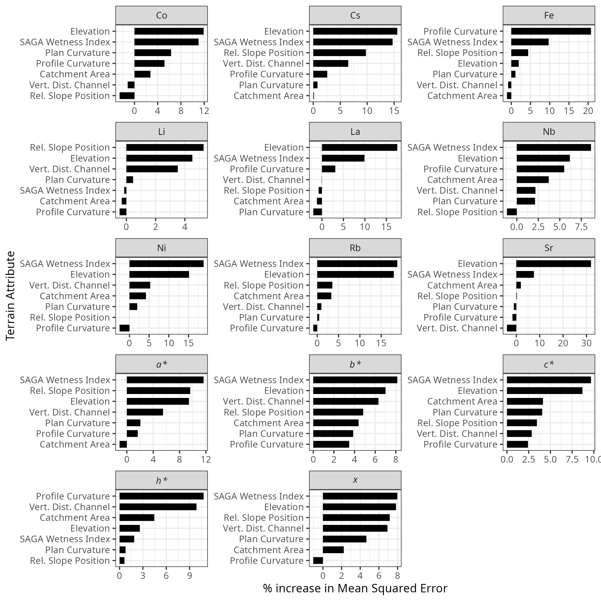
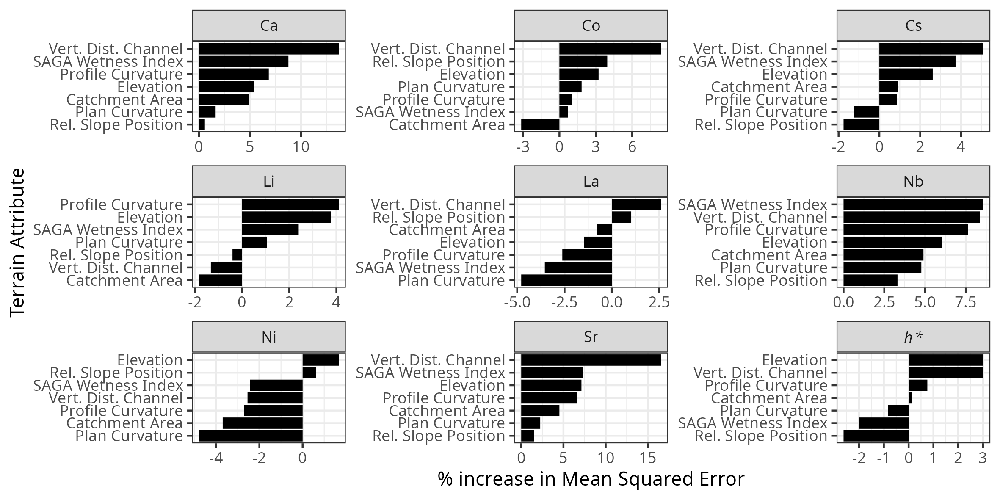

::: {.content-visible when-format="docx"}
## Abstract {.unnumbered}

Quantifying field-scale (∼40 ha) spatial variability in soil geochemical and colour (spectral reflectance) properties is important for sediment source fingerprinting.
The main objectives of this study were to: 1) quantify the spatial variability and spatial dependence for a set of 15 properties (10 geochemical elements: Ca, Co, Cs, Fe, Li, La, Nb, Ni, Rb, Sr; and 5 colour coefficients: *a\*, b\*, c\*, h\**, and *x*) measured from the \<63 μm fraction at an agricultural and forested site; and 2) assess how seven terrain attributes (elevation, SAGA wetness index, relative slope position, catchment area, vertical distance to channel network, plan curvature, profile curvature) relate to these properties through correlation and Random Forest (RF) regression.
Across both sites, colour properties exhibited approximately normal distributions with low coefficients of variation (CV), whereas geochemical properties were more variable and skewed.
Semivariograms indicated strong spatial dependence for most properties at the agricultural site (median range ≈ 210 m) and moderate dependence at the forested site (ranges 176–298 m).
RF models performed better at the agricultural site; elevation, wetness and slope position were the top-ranked predictors for most properties.
These results support DEM-based sampling strategies.
In practice, sample spacing on the order of the semivariogram range (∼200–230 m) can suffice for mapping in simple agricultural settings, whereas stratified designs (e.g., near-stream vs. hillslope) may be preferable in more complex forested terrains.
:::

## Introduction

Spatial variation in soil properties arises from soil-forming factors (parent material, relief, biota, climate, time) and is further modified by land use and management practices.
Developing a sampling design that adequately characterizes the patterns and drivers of this variation is an important component of many agricultural and environmental studies [@soligo2023; @lark2018].
For example, to meet the desired level of precision for agronomic and environmental nutrient management plans the spatial variability in soil nutrients will influence the soil sampling design in terms of number and locations of soil samples [@kariuki2009; @starr1995].
Similarly, accounting for spatial variability extends to sediment source fingerprinting, as unaccounted spatial heterogeneity within sources of sediment can compromise the source apportionment results [@du2017].

Sediment source fingerprinting is a watershed-scale technique that is used to quantify the relative proportions of sediment derived from unique sources.
This technique uses naturally occurring biogeochemical properties as fingerprints (i.e., tracers) to link potential sources of sediment to downstream sediment.
Investigating the spatial variability at a watershed-scale can be advantageous to identify, classify, and distinguish between potential sources of sediment [@collins2020].
However, investigating spatial variability at smaller scales is less common [@du2017; @pulley2018; @collins2019; @lunamiño2024] and remains a research priority [@collins2020].
Within the sediment source fingerprinting approach field-scale (\<1 km²) variability is important for (i) designing efficient, representative source sampling, (ii) integrating spatial variability with erosion/delivery gradients for mixing models, and (iii) selecting fingerprints supported by process-based reasoning.
Previous work has highlighted spatial variability issues and the need for more robust, process-informed fingerprint selection and sampling strategies.

Characterization of fingerprint properties requires representative sampling, particularly because variability in some properties is not random but follows systematic spatial patterns across the landscape.
For example, the pattern of fallout radionuclides will reflect the long-term patterns of soil erosion and deposition [@wilkinson2015].
Designing and implementing source sampling campaigns must consider these patterns, as the sampling design used has been shown to influence the characterization of a wide range of commonly used fingerprints [@lunamiño2024].
The lack of standardization in sediment source sampling designs makes it difficult to compare results across studies and creates uncertainties in the interpretation of results [@lunamiño2024].

Characterization of sources is further complicated by variations in erosion and sediment delivery rates across the landscape.
Many mixing models use well defined inputs (sources) and outputs (sediment) characterized by mean and standard deviation but do not consider the spatial distribution of fingerprint properties.
This is a limitation of the methodology as samples collected closer to and more hydrologically connected with the stream network may better represent the source, even if they deviate from the mean value.
Strategic/judgment sampling targeting the likely to eroded areas may improve representativeness, but it prevents an overview of the broader spatial patterns, limiting the interpretation of landscape processes across the entire source area.
There has been progress using information on erosion rates to calculate an erosion rate-weighted mean [@wilkinson2015; @du2017] and using spatially interpolated maps of fingerprint values to provide a finer resolution of the fingerprint variability within each source [@haddadchi2019].
Characterizing the geomorphic, hydrologic, and biochemical processes underlying spatial variability supports the selection of reliable fingerprints and informs sampling design for source characterization.
While many studies employ a statistical-based approach [@collins1997] to select suitable fingerprints, concerns remain that this method may lead to the inclusion of false positives (i.e., type I errors), whereby a fingerprint is incorrectly identified as having discriminatory power between sources when it does not, resulting in the selection of non-conservative fingerprints [@koiter2013].
Consequently, there has been a call for the inclusion of a process-based (e.g., weathering, erosion) or geologic-based explanation of the fingerprints selected to address these concerns [@collins2020; @nosrati2020].
This remains challenging due to limited data on soil properties, particularly with geochemical properties, as routine lab analysis often measures more than 50 elements.

The spatial patterns of some soil properties are well studied because of their agronomic importance or ability to infer other important soil properties and processes and include fallout radionuclides [e.g., ^137^Cs, ^7^Be @ritchie1970], plant nutrients [e.g., N, P @vasu2017], soil colour [e.g., hue, value @viscarrarossel2006], major non-acid forming cations [e.g., Ca, Na @sun2021].
In contrast, the processes that control the distribution of rare earth elements and trace metals, are less well studied or tend to be site-specific, making it difficult to draw generalizations.
With the growing adoption of DEM-based terrain analysis to guide soil sampling, there is a corresponding need for analytical approaches capable of handling complex, non-linear relationships among terrain attributes, for which Random Forest (RF) provides a suitable framework.

Terrain attributes such as elevation, slope curvature, slope position, and soil wetness indices have been shown to be useful information in the characterization and modelling of a range of soil properties including soil moisture [@beaudette2013], texture [@kokulan2018], colour [@brown2004], organic matter [@zhang2012], conductivity [@umali2012], enzyme activity [@tajik2012], soil depth [@mehnatkesh2013], and geochemistry [@lima2023].
Similar techniques may provide additional insight into the pedologic and geomorphic processes that drive the observed patterns of fingerprint properties within a given source.
Digital elevation models (DEMs) are more widely available through public databases and can be generated using drone imagery, whereas soil property data are more limited in availability and spatial coverage.
As a result, terrain attributes derived from DEMs offer a practical and more readily available basis for guiding efficient and spatially informed soil sampling designs [@minasny2006; @degruijter2006].
These DEM-based sampling designs include conditioned Latin hypercube [@minasny2006], feature space coverage [@ma2020], and covariate-wise [@zízala2024] sampling methods.

This study builds on the previous work of Luna Miño [-@lunamiño2024] where the impact of three different sampling designs on the characterization of source materials, within the framework of the sediment fingerprinting approach, was assessed.
Although the designs produced numerically different results, they led to the same overall conclusions.
This study expands upon that previous work by using data obtained from a grid sampling approach to assess spatial autocorrelation and identify important terrain attributes driving the observed patterns.
The overall goal of this research is to apply DEM-derived terrain attributes and a non-parametric importance ranking to guide the sampling process.
The objectives of this study were to: (1) quantify the spatial variability and spatial dependence of 15 fingerprint-relevant soil properties across an agricultural and forested field site; (2) test the relation between these soil properties and seven terrain attributes, using correlation and Random Forest regression to identify terrain controls and their relative importance; and (3) identify patterns or groups in the data, using unsupervised Random Forest regression and hierarchical clustering to guide stratified sampling.
Together, these objectives address how terrain attributes may be used to understand spatial distributions of soil properties and help guide sampling design.

## Methods

### Site description

Two sites within \~4 km of each other in the Wilson Creek Watershed (WCW), near McCreary, Manitoba, Canada were sampled (@fig-location_map).
The mixedwood forest site (50°43'35"N, 99°33'36"W; 369.2 masl) in Riding Mountain National Park consists of white spruce (*Picea glauca*), black spruce (*Picea mariana*), balsam fir (*Abies balsamea*), larch (*Larix laricina*), and trembling aspen (*Populus tremuloides*), with soils likely part of the Grey Wooded soil association (Luvisol) developed on boulder till of mostly shale with some limestone and granitic rocks [@ehrlich1958].
This site has a local relief of 17.9 m and moderately complex terrain, dissected by Wilson Creek, a meandering stream with a gradient of approximately 0.006 m m-1, featuring a small floodplain 5 to 25 m wide and adjacent upland areas (@fig-location_map).
The agricultural site (50°45'15”N, 99°30'49"W; 309.9 masl) includes grain and forage rotations and is mapped to the Edwards Soil Series (Cumulic Regosol) with silty clay loam to silty clay soils developed on alluvial deposits [@ehrlich1958].
The site has relatively simple terrain with a local relief of 2.8 m and drains toward the northeast corner of the field, where Wilson Creek runs along the northern edge as a straight, engineered channel (@fig-location_map).
The region has a Dfb climate [@beck2018], with a mean annual temperature of 3.0°C, annual precipitation of 539 mm (\~27% as snow) [@environmentandclimatechangecanada2026], and snowmelt-dominated runoff, with about 80% occurring in May and June [@mackay1970].



### Soil sampling and analysis

At each site, 49 surface samples were collected on a 7×7 grid (100 m spacing) (@fig-location_map).
Forested samples were collected 0–5 cm below the LFH to characterize the mineral A horizon, minimizing organic layer heterogeneity; agricultural samples were 0–15 cm to reflect mixing by tillage and operations and to capture the actively managed surface layer.
Samples were dried, homogenized, and sieved to \<63 μm to minimize grain-size and organic matter effects across sites and to align with established fingerprinting protocols (Laceby et al., 2017).
Samples were analyzed for a broad suite of geochemical elements using aqua- regia digestion with ICP-MS (ALS Mineral Division, North Vancouver, BC, Canada).
Spectral measurements were made with a spectroradiometer (ASD FieldSpecPro Malvern Panalytical Inc Westborough MA 01581, United States).
Spectral reflectance measurements were taken in 1 nm increments over the 0.4-2.5 μm wavelength range.
Both samples and the Spectralon standard (white reference) were illuminated with a white light source using a halogen-based lamp (12 VDC, 20 Watt).
Dark-current correction and white reference were completed between samples.
Fifteen colour coefficients (@supptab-abbrev) were computed from each sample, where each sample represents the average of 10 spectra, following published methods [@koiter2021; @boudreault2018].
Based on the results of Luna Miño [-@lunamiño2024], a composite fingerprint consisting of 10 geochemical elements (Ca, Co, Cs, Fe, Li, La, Nb, Ni, Rb, and Sr) and five colour coefficients (*a\*, b\*, c\*, h\*,* and *x*) were identified as providing a strong discrimination between the agricultural and forested surface soils.
These fifteen soil properties are the focus of the detailed spatial analysis detailed in this study.

### Geospatial and terrain analysis

All geostatistics were performed with ArcGIS Pro [v 3.3.0 @esri2024].
Semivariograms were used to quantify spatial correlation for each of the 15 soil properties.
The optimization tool, based on minimizing the mean square error, was used to parameterize the semivariogram model.
In all cases the Stable model type was used as it offers greater flexibility in fitting the spatial correlation structure.
The semivariograms were visually inspected to verify the suitability of the automated fits.
Kriging was used to interpolate and generate maps of each soil property.
The exploratory interpolation tool (Geostatistical Analyst extension) was used to select the kriging type with the highest ranked prediction accuracy.
Cross-validation was used to assess the performance of the spatial interpolation and the measured and predicted values were plotted and the r^2^ was reported.

The forested digital elevation model (DEM) was derived from Natural Resources Canada's High-Resolution DEM Mosaic (HRDEM) [@naturalresourcescanada2024], while the agricultural DEM was generated using UAV photogrammetry processed in Agisoft Metashape [v1.8.2 @agisoft2021] with ground control points.
Both DEMs were interpolated into 1 m resolution grids using ordinary kriging.
Terrain attributes including elevation, plan and profile curvature, SAGA wetness index, catchment area, relative slope position, and vertical distance to channel network were computed in SAGA GIS [v2.1.4 @conrad2015] (@supptab-terrain).
The native resolution between the HRDEM and UAV-derived DEM differ, which may affect curvature metrics.
The rasters were resampled to 10 m resolution [`terra`v1.8.42 @hijmans2024] prior to statistical analysis to harmonize spatial support.

### Data analysis

All subsequent statistical analysis was undertaken using R statistical Software v4.5.3 [@rcoreteam2026] through RStudio Integrated Development Environment v2026.04.0 [@rstudio2026]).
Plots and maps were created using the R package `ggplot2` v3.5.2 [@wickham2016].
Univariate summaries included CV classes (low \<15%, moderate 15–35%, high 35–75%, very high \>75%) [@pennock2008] and skewness categories (symmetric: −0.5 to 0.5; moderate: −1.0 to −0.5 or 0.5 to 1.0; high: \<−1.0 or \>1.0).

Random forest regression (RF) [`randomForest` v4.7.1.2 @liaw2002] was used to assess the relative importance of the terrain attributes on the spatial distribution of soil properties.
The dataset was randomly split into training (70%) and testing (30%) datasets.
Multicollinearity among the terrain attributed was assessed using the Variance Inflation Factor with a threshold of eight [`usdm` v2.1.7 @Naimi2014].
The number of variables randomly sampled as candidates (mtry) at each split within the RF model was tuned using the training data set [`caret` v7.0.1 @kuhn2008].
The number of trees to grow was set to 500 to ensure the error has stabilized and that additional trees provide diminishing returns.
Model performance was assessed using the Mean Square Error (MSE) and percent variance explained for both the training (Out of Bag Error) and the validation data sets.
Additionally, the variable importance stability of the top three predictors was assessed using using the measure_stability() function from the R package optRF (v1.2.1, @lange2025), where values range from 0 (unstable) to 1 stable).
To evaluate the model, measured and predicted values were plotted, and the R² and MSE were computed using the test dataset.
Given the small test sample size, bootstrapping with 1,000 replicates (boot v1.3-32 @davison1997; @canty2025) was employed to estimate these metrics along with their 95% confidence intervals to support interpretation.Variable importance is reported as percent increase in MSE.

Unsupervised RF regression of the seven terrain attributes, followed by hierarchical clustering, was used to group similar areas of landscape for each site based on their terrain characteristics.
The clustering method (e.g., Ward's, minimum linkage) and number of clusters were chosen by assessing data structure through Principal Component Analysis plots and spatial coherence on maps, selecting the solution that produced the most meaningful and coherent regions for sampling.

<!-- Additionally, the univariate and RF analysis was also completed using interpolated 10 m resolution dataset. -->

<!-- Because this dataset was larger, the data were randomly split into training (60%), validation (20%), and testing datasets (20%). -->

<!-- To assess the potential artifacts from interpolation (i.e., pseudoreplication), RF predictions were also evaluated on the original 49 non-interpolated points at each site. -->

## Results

### Univariate summary

The univariate analysis demonstrated some variability patterns between colour and geochemistry properties and sites (@tbl-univariate-summary).
All five colour coefficients display a symmetric distribution and low CV, with the exception of a moderate CV for *b\** in the forested site.
Geochemistry data display greater variability.
At the agriculture site, eight elements showed a symmetric distribution and two displayed moderate skew (Li, Co); six had low CV, two had moderate (Cs, Rb), and two had high (Ca, Sr).
The forested site had six elements displaying symmetric distributions, three with moderate skew (Fe, Nb, Sr), and one with a large skew (Ca); three had low CV, five had moderate, one had high (Sr) and one very high (Ca).
Overall, this highlights that the measured geochemical properties more skewed and variable compared to the colour properties across both sites.

The mean plan and profile curvature measurements for both sites are near zero, indicating an area of sediment transit and not accumulation or erosion (@tbl-univariate-summary2).
The agricultural site had a higher SAGA Wetness Index but the forested site had a larger range in values and exhibited greater variability.
The forested site exhibited a smaller mean Relative Slope Position value (streams and depressional areas) and a smaller Vertical Distance to Channel Network, and for both terrain attributes a greater variability as compared to the agricultural reflecting the presence of the stream crossing the forested site.





### Spatial analysis

Within the agricultural site all 15 properties displayed spatial autocorrelation; many with strong dependence (@tbl-geocol-semivariogram).
Semivariogram ranges spanned \~185–580 m (median ≈210 m).
Ca and Rb exhibited large ranges (580 m and 551 m), while colour metrics such as *b\** and *c\** had ranges \~199 m.
The nugget (Co) was small for all soil properties (\<1.5).
A few of the soil properties presented a pattern that roughly matches (e.g., Rb) or mirrors (e.g., Ca, Sr) the overall topography of the site with a gradation between the highest point in the south-west corner towards the lowest points in the north-east (@fig-ag_map).
Other properties appear to have more localized high and low concentrations/values (e.g., *c\**, *h\**).
Within the forested site nine properties showed spatial dependence (moderate to strong) with ranges 176–298 m; Fe, Rb and colour *a\**, *b\**, *c\**, *x* lacked detectable autocorrelation, consistent with more complex depositional/topographic features found at this site (@tbl-geocol-semivariogram).
This complexity also resulted in poorer spatial interpolation performance compared to the agricultural site.
The nugget (Co) was generally small for most soil properties (\<2) with the exception of La and Ni.
Overall, the influence of the channel and floodplain environment can be seen in the pattern of the nine soil properties (@fig-forest_map).







With the exception of *h\** all the soil properties measured at the agricultural site were significantly (p \< 0.05) correlated with the elevation and the wetness index (@tbl-correlation).
A few soil properties (Li, Ni, Sr, *a\** and *x\**) were correlated relative to slope position and vertical distance to the channel, and there was little to no correlation with catchment area and curvature attributes.
Overall, there was little correlation between soil properties and terrain attributes at the forested site (@tbl-correlation).
<!-- Correlation analysis using the interpolated data show more significant and stronger correlation between soil properties and terrain attributes with the exception of no correlation with plan and profile curvature attributes at the agricultural site (@tbl-correlation). -->



No multicollinearity among the terrain attributes at either site was detected and all seven attributes were retained for all analysis.
The mtry parameter selected for each model varied with most using a value of four.
The RF regression model showed variable explanatory power and performance across soil properties and sites (@tbl-rf-summary).
For the agriculture site, the model explained a low to moderate proportion of variance, ranging from 17.2% (Nb) to 76.1% (Rb).
Interestingly, the RF analysis for Li yielded a negative percentage of variation explained, suggesting that the mean value provided a better predictor.
Testing the model showed moderately good to poor performance with r^2^ values ranging from 0.01 (Fe) to 0.85 (Rb, Sr).
The variable importance stability for the top three predictors was high (@tbl-rf-summary), indicating a consistent ranking across model runs.
The SAGA Wetness Index and elevation were generally the most important terrain attributes in the model with profile and plan curvature as the least important terrain attributes (@fig-rf-results).
Additional details on variable importance are provided in @suppfig-ag_RF_summary.





Overall the RF regression analysis at the forested site demonstrated poor explanatory power and low performance (@tbl-rf-summary).
The RF models for Ca, Nb, and Sr explained a moderate proportion of variance.
Similar to Li at the agricultural site, all other soil properties demonstrated that the average value was a better predictor.
Model performance was also poor with all r^2^ values below 0.2.
The variable importance stability for the top three predictors was moderate (@tbl-rf-summary), indicating a reasonable consistent ranking across model runs.
The importance ranking varied considerably between soil properties; however, the vertical distance to channel and elevations were generally the most important terrain attributes in the model (@fig-rf-results).

Unsupervised random forest regression and hierarchical clustering were used to classify sites.
At the agricultural site, two clusters were identified using Ward's method.
At the forested site, three clusters were identified using the unweighted pair group method with arithmetic mean (UPGMA).
Although the principal Component Analysis plots showed considerable overlap among clusters at both sites, the resulting maps show some interesting patterns (@fig-cluster).
At the agricultural site, the classification highlights areas where water accumulates in the field and is routed toward the adjacent ditch.
At the forest site, the pattern is less clear but the clusters seem to distinguish the channel environment, areas adjacent to the channel/depressional areas, and the surrounding upland zones.



<!-- As expected, the RF regression analysis with the interpolated data exhibited much stronger explanatory power and predictive performance, with the models better performing at the agricultural site compared to the forested site (@tbl-rf-summary) Elevation was consistently the terrain attribute that provided the greatest predictive power (@fig-rf-results). -->

<!-- SAGA Wetness and relative slope position were generally the second and third most informative terrain attributes. -->

<!-- Plan curvature was consistently ranked least important predictive terrain attribute. Additional details on variable importance are provided in @suppfig-forest_RF_summary. -->

## Discussion

### Variability of soil properties

Variability in soil geochemical properties has been studied at a range of scales including continental [@drew2010], regional [@rattenbury2018], watershed [@nanos2012], hillslope/catena, and farm field [@sun2021a].
The objectives of these studies included addressing issues of pollution/contamination, providing benchmark/baseline information, investigating pedological and weathering properties and processes, and soil surveying and mapping [@wilson2008].
Variability in soil colour, typically using the Munsell colour system, is a commonly reported diagnostic feature used in soil classification and ranges in spatial scales from reconnaissance to detailed soil surveys and maps.
For sediment fingerprinting studies, these types of studies are often too site-specific or focus on a smaller subset of soil properties to effectively guide sample design to ensure the desired confidence is met characterizing sources of sediment.
Data distributions in soil science commonly exhibit a positively skewed distribution.
This is likely due to several factors including that data of this nature are a semi-bounded distribution, with a lower bound of zero and no upper bound.
Hot spots of soil processes, local variations in soil forming factors, and soil/land management practices can also lead to more extreme values [e.g., @vidon2010].
In many cases the cumulative effects of these processes, factors, and practices are multiplicative (i.e., interact) and not linearly additive, resulting in a skewed data distribution.
Lastly, the distribution of data will also be a product of the scale of observation, number of samples, and sampling design.
Soil colour properties exhibited a near-normal distribution with a low CV which is consistent with claims that soil hue and value (Munsell colour system) have a low CV [@pennock2008].
These data distribution properties are ideal for statistical and environmental modeling as it typically meets the model assumptions without requiring transformations.
Soil colour coefficients (*a\**, *b\**, *c\**, *h\**, *x*) showed near-normal distributions and low CVs (@tbl-univariate-summary), supporting their suitability for mixing models that assume normality and require low within-source variability.

The geochemical properties exhibited greater variability and skewness despite removing coarse fraction, reflecting site-specific pedogenic and geomorphic processes and organic matter differences.
Trace elements correlate strongly with fine material (\<2 μm) due to its high surface area and reactivity [@horowitz1991].
Removing sand-sized material reduced grain-size effects, likely resulting in lower variability than in bulk soil studies (\<2 mm).
In particular, the forested site exhibited a greater amount of variability which is likely due to the more complex topography and geomorphic setting.
The floodplain within the forested site is likely accumulating shale-rich material derived from the Manitoba Escarpment which is enriched in trace metals [@nicolas2011].
This creates a zone of high concentrations relative to upland areas (@fig-forest_map).
The forested site also had a higher and much more variable soil organic matter content (x̄ = 11.6 %, CV = 51.9 %) as compared to the agricultural site (x̄ = 8.6 %, CV = 16.1 %), which similarly to the grain size distribution, can influence the concentration of many major and trace elements [@horowitz1991].
These results provide evidence that land use and landscape complexity play a role in driving soil property variability that can be considered when developing a strategic sampling design.

### Spatial distribution

The difference in the number of soil properties and the magnitude of the spatial auto correlation between the two sites can be used in designing an effect sampling campaign.
The agricultural site, which has a simpler topography and a higher degree of spatial autocorrelation, grid sampling with spacing on the order of the semivariogram range (∼200–220 m) is adequate for mapping.
In contrast, the forested site, which has a more complex geomorphic setting and a lower degree of spatial autocorrelation, a stratified sampling design is recommended.
At the forested, site the stratas could include near-stream and hillslope environments (@fig-cluster).
When the spatial distribution of soil properties are unknown, often the case in fingerprinting studies, it is recommended that sampling include irregularly spaced points (including \<100 m) to better resolve short-range structure.
This is important for improving variogram modeling and kriging interpolation [@lark2018].
Properties lacking spatial autocorrelation at the forest site (Fe, Rb, *a\**, *b\**, *c\**, *x*) likely reflect mixed depositional environments and fine-scale heterogeneity that exceed the sampling resolution; acknowledging their behavior is critical when selecting fingerprints.

Mapping the soil properties that have a moderate to high spatial dependence can provide information on underlying soil forming processes and properties.
At both sites, to some extent, the patterns appear to reflect the topography of the sites suggesting that geomorphic and hydrologic processes and properties are likely driving the observed patterns.
Koiter et al. [-@koiter2013] discussed the issues surrounding the use of a statistical only approach to selecting fingerprints and that consideration of how fingerprints have developed improves the robustness of the sediment fingerprinting approach.
However, local information on the spatial distribution of geochemical and colour properties at field scales (\< 1 km²) is often unavailable, and the processes driving these patterns are also not well documented or studied.
When such information does exist, it typically focuses on agronomically important properties [e.g., @mzuku2005] or is used for soil classification [e.g., @soilclassificationworkinggroup1998].
These datasets usually include geochemical properties such as N, P, K, S, Ca, Mg, Na, Fe, and Al.
They may also include colour characteristics, such as Munsell hue, value, and chroma, as well as other soil properties like texture, organic matter content, and pH. The lack of information on the wide range of soil properties used in fingerprinting studies means the researchers are relying on other data, most often elevation and geomorphic/topographic features, for informing sampling designs.
The results from this study support this approach at the agricultural site where the terrain is less complex.

### Terrain attributes and soil properties

The correlation analysis identified elevation and wetness as being significantly correlated to most of the fingerprint properties at the agricultural site.
Similarly, the RF regression identified elevation, wetness, and relative slope position as important attributes in explaining most of the observed variation in soil geochemical and colour properties.
These terrain attributes align with established pedogenic and geomorphic processes, including eluviation–illuviation of Fe and clay, carbonate dissolution and transport, and organic matter accumulation in lower positions, and thereby indirectly influence soil geochemistry and colour.

The results of this study are consistent with the findings of Mashalaba et al. [-@mashalaba2020] who also found that similar terrain attributes were important in predicting a range of other soil properties including texture, bulk density, and hydaulic conductivity.
These attributes likely emerged as the most important factor in explaining the observed variability as they are strongly linked to a range of geomorphic and hydrologic processes and conditions [@mello2022; @libohova2024].
For example, in eroded landscapes in the Prairie region of Canada, Ca concentrations have been found to be higher in upper slope positions from erosion and subsequent exposure of high-carbonate subsoil [@papiernik2005].
In contrast, higher Ca concentrations have been noted in lower slope and depressional areas due to higher solubility of many Ca-minerals (e.g., CaCO3) and the subsequent downslope transport in solution and reduced leaching losses in these accumulation zones.

Landscape position can also have a strong influence on pedogenic process; for example, the translocation of Fe and clay down the soil profile is a diagnostic criterion used in classifying soils [@stonehouse1971].
Soil colour also tends to change in a predictable manner in relation to local relief.
Tillage and water erosion results in the net loss of darker organic-rich topsoil from upper slope positions resulting in the exposure of the lighter subsoil [@papiernik2005].
Moisture availability is also greater in lower slope and depressional areas, resulting in increased organic matter production and consequently darker, organic-rich topsoil compared to upper slope positions.
There is also evidence that suggests that soil texture varies with elevation and slope position, with coarser material on upper slopes and finer material accumulating in lower positions [@kokulan2018; @cox2003].
Given the strong correlation of organic matter and texture with soil geochemistry [@horowitz1991] and colour [@viscarrarossel2009], these properties may also help explain the observed spatial patterns.

Compared to the forest site, the RF regression model showed greater explanatory power and predictive performance for the agricultural site, likely due to its simpler topography.However, at the forested site, the RF model showed poor fit, and terrain variables were largely uninformative in predicting fingerprint properties (@fig-cluster); this likely reflects the increased geomorphic complexity of the site and the limitations of sparse sampling.
Additional work is needed to fully assess the utility of terrain mapping in predicting and mapping fingerprint properties, particularly in complex terrains.
Clustering based on terrain attributes using unsupervised RF regression (Figure 5) showed some promise in serving as an initial step in developing efficient and effective sampling designs (Pham et al., 2025).
As high-quality LiDAR data and digital elevation models (DEMs) become increasingly available in many regions, researchers have the opportunity to integrate terrain attributes into their sampling frameworks.
As Evrard et al. (2022) suggests, a balance between the number of samples and budget and logistical constraints needs to be made.
This integration will help ensure adequate representation of key geomorphic and topographic features while reducing sampling and analytical costs by minimizing redundant sampling in similar areas.

### Limitations and Future Work

The impact of sampling design the characterization of fingerprints can be substantial [@lunamiño2024], which in turn can affect the apportionment results, and the conclusion and recommendations drawn from them.
However, due to the high cost of sample collection, preparation, and analysis, small sample sizes collected across a single season are commonplace and a source of uncertainty in sediment fingerprinting studies [@evrard2022].
Therefore, the development of low-cost, easy, and accurate mapping of fingerprinting properties would be advantageous.
Terrain attributes have been successfully used in digital soil mapping exercises, demonstrating their value in spatially characterizing soil properties [@rizzo2016].
Building on this success, integrating terrain analysis into sediment source fingerprinting is promising, not only as a mechanism to improve the quality of source characterization, but to also better link source material to downstream sediment.
However, the inclusion of only two sites within in this study limits the generalizability of the findings to geomorphic settings with similar characteristics, highlighting the need for future research across a broader range of environments.

The relatively small sample size (n=49 per site) in this study compromises the stability of the RF-derived importance metrics.
Similarly, the 100 m sample spacing likely fails to capture fine-scale heterogeneity, limiting the ability of the semivariogram models to characterize short-range spatial variability.
As a result, additional sampling at irregular spacing is highly recommended.
Because this study relies on single season of sampling there is no information on the stability of soil properties over time.
While sediment fingerprinting assumes consistent source signatures over time, few studies validate this due to the challenges associated with repeated sample collection [@evrard2022].

The continued integration of DEM-based sampling strategies and fingerprint mapping into sediment source fingerprinting approach will benefit from the development of a standardized framework, workflow, and set of best practices to ensure both robust and reliable results.
For example, differences in DEM resolution between sites in this study could influence curvature-based terrain attributes, introducing potential bias.
Furthermore, the use of isotropic variogram models may not adequately represent spatial autocorrelation in channelized landscapes, where directional variability is expected.
Additional work is needed to establish standardized protocols for DEM processing, terrain attribute calculation, and variogram modeling to ensure that methods work across a range of landscapes.
Lastly, coupling machine-learning approaches, such as RF regression, with process-based soil landscape models, geophysical surveys would further clarify fundamental mechanisms underlying observed patterns.

## Conclusions

Understanding the spatial variability and distribution of soil geochemical and colour properties at a field-scale is an important part of sediment source fingerprinting.
This study conducted both univariate and spatial analyses of a suite of soil geochemical and colour properties at two sites with contrasting land uses.
The agricultural site, characterized by a simple topography, exhibited lower coefficients of variation, approximately normal data distributions, and moderate to strong spatial autocorrelation across most measured properties.
In contrast, the forested site featured more geomorphologically complex terrain, with greater variability in soil properties, data distributions that more frequently deviated from normality, and fewer properties exhibiting spatial autocorrelation.
RF regression demonstrated that many fingerprint-relevant properties exhibit usable spatial dependence at the field scale.

Elevation, wetness, and slope position explained a substantial portion of the observed variability only at the agricultural site, supporting the use of DEM-guided sampling strategies in simple terrains.
For effective mapping of sediment fingerprinting properties at the field scale, a grid spacing approximately equal to the site-specific semivariogram range (\~200–230 m) is recommended.
In areas with complex terrain, stratified sampling should be implemented to capture spatial variability and improve representativeness.
Furthermore, colour coefficients such as *a\*, b\*, c\*, h\**, and *x* are ideal for inclusion in sediment mixing models when low coefficients of variation and near-normal data distributions are assumed.

## Acknowledgments {.unnumbered}

Special thanks and recognition for the field and technical support from A.
Avila and the Riding Mountain National Park personnel.

## Statements and declarations {.unnumbered}

### Funding {.unnumbered}

This research was supported by the Natural Sciences and Engineering Research Council of Canada Discovery Grant - From source to sink: Investigating the linkages between sources of sediment and downstream water quality in Canadian watersheds - awarded to AJK (RGPIN-2019-05273).

### Competing interests {.unnumbered}

The authors have no competing interests to declare that are relevant to the content of this article.

### Data and code availability {.unnumbered}

Data and source code for analysis and manuscript available on GitHub: <https://github.com/alex-koiter/terrain-attributes>

Additional information, including analytical notebooks with details of the analysis and intermediate steps, is available online: <https://alexkoiter.ca/terrain-attributes/>

### Author contributions {.unnumbered}

**M Luna Miño** Methodology; Investigation; Data curation; Formal analysis; Writing - Original Draft; Writing - Review & Editing

**A Koiter**: Conceptualization; Funding acquisition; Methodology; Investigation; Data curation; Formal analysis; Visualization; Writing - Original Draft; Writing – review and editing; Software; Project administration

**T Lychuk**: Methodology; Formal analysis; Writing - Review & Editing

**A Waddel** Methodology; Formal analysis; Writing - Review & Editing

**A Moulin** Methodology; Formal analysis; Writing - Review & Editing

## References {.unnumbered}

::: {#refs}
:::

## Supplemental figures

::: {#suppfig-ag_RF_summary}
{width="100%"}

Variable importance, expressed as the percentage increase in Mean Squared Error, for soil colour and geochemical fingerprint properties derived from random forest models using terrain attributes as predictorsat the agricultural site.
:::

::: {}
{width="100%"}

Variable importance, expressed as the percentage increase in Mean Squared Error, for soil colour and geochemical fingerprint properties derived from random forest models using terrain attributes as predictorsat the forest site.
:::

## Supplemental tables {.unnumbered}

::: {#supptab-abbrev}
+------------------------+---------------------------------------------------+---------------+
| **Colour space model** | Parameter                                         | Abbreviation  |
+========================+===================================================+===============+
| RGB                    | Red                                               | R             |
+------------------------+---------------------------------------------------+---------------+
| RGB                    | Green                                             | G             |
+------------------------+---------------------------------------------------+---------------+
| RGB                    | Blue                                              | B             |
+------------------------+---------------------------------------------------+---------------+
| CIE xyY                | Chromatic Coordinate x                            | x             |
+------------------------+---------------------------------------------------+---------------+
| CIE xyY                | Chromatic Coordinate y                            | y             |
+------------------------+---------------------------------------------------+---------------+
| CIE xyY                | Brightness                                        | Y             |
+------------------------+---------------------------------------------------+---------------+
| CIE XYZ                | Virtual component X                               | X             |
+------------------------+---------------------------------------------------+---------------+
| CIE XYZ                | Virtual component Z                               | Z             |
+------------------------+---------------------------------------------------+---------------+
| CIE LAB                | Metric lightness function                         | L             |
+------------------------+---------------------------------------------------+---------------+
| CIE LAB                | Chromatic coordinate opponent red--green scales   | *a\**         |
+------------------------+---------------------------------------------------+---------------+
| CIE LAB                | Chromatic coordinate opponent red--green scales   | *b\**         |
+------------------------+---------------------------------------------------+---------------+
| CIE LUV                | Chromatic coordinate opponent blue--yellow scales | *u\**         |
+------------------------+---------------------------------------------------+---------------+
| CIE LUV                | Chromatic oordinate opponent red--green scales    | *v\**         |
+------------------------+---------------------------------------------------+---------------+
| CIE LCH                | CIE hue                                           | *c\**         |
+------------------------+---------------------------------------------------+---------------+
| CIE LCH                | CIE chroma                                        | *h\**         |
+------------------------+---------------------------------------------------+---------------+

: Description of spectral reflectance colour coefficients used as fingerprints. Reproduced from Boudreault et al. (2018)
:::

::: {#supptab-terrain}
+------------------------------+-----------------------------------------------------------------------------------------------------------------------------------------------------------------------------------------------------------------------------------------------------------------------------------------------------------------------------------------------------------------+
| Terrain Attribute            | Description                                                                                                                                                                                                                                                                                                                                                     |
+==============================+=================================================================================================================================================================================================================================================================================================================================================================+
| Elevation                    | Meters above sea level                                                                                                                                                                                                                                                                                                                                          |
+------------------------------+-----------------------------------------------------------------------------------------------------------------------------------------------------------------------------------------------------------------------------------------------------------------------------------------------------------------------------------------------------------------+
| Plan Curvature               | Across slope curvature                                                                                                                                                                                                                                                                                                                                          |
+------------------------------+-----------------------------------------------------------------------------------------------------------------------------------------------------------------------------------------------------------------------------------------------------------------------------------------------------------------------------------------------------------------+
| Profile Curvature            | Down slope curvature                                                                                                                                                                                                                                                                                                                                            |
+------------------------------+-----------------------------------------------------------------------------------------------------------------------------------------------------------------------------------------------------------------------------------------------------------------------------------------------------------------------------------------------------------------+
| SAGA Wetness Index           | Similar to the 'Topographic Wetness Index' (TWI), but it is based on a modified catchment area calculation, which does not think of the flow as very thin film. As result it predicts for cells situated in valley floors with a small vertical distance to a channel a more realistic, higher potential soil moisture compared to the standard TWI calculation |
+------------------------------+-----------------------------------------------------------------------------------------------------------------------------------------------------------------------------------------------------------------------------------------------------------------------------------------------------------------------------------------------------------------+
| Catchment Area               | Area of upslope contributing area                                                                                                                                                                                                                                                                                                                               |
+------------------------------+-----------------------------------------------------------------------------------------------------------------------------------------------------------------------------------------------------------------------------------------------------------------------------------------------------------------------------------------------------------------+
| Relative Slope Position      | A value between 0 and 1 illustrating the position of a pixel within the landscape with values approaching 0 indicating streams to pits, and values approaching 1 indicating upper slope positions to peaks                                                                                                                                                      |
+------------------------------+-----------------------------------------------------------------------------------------------------------------------------------------------------------------------------------------------------------------------------------------------------------------------------------------------------------------------------------------------------------------+
| Vertical Distance to Channel | The vertical distance to a channel network base level. The algorithm consists of two major steps:                                                                                                                                                                                                                                                               |
|                              |                                                                                                                                                                                                                                                                                                                                                                 |
|                              | 1\. Interpolation of a channel network base level elevation\                                                                                                                                                                                                                                                                                                    |
|                              | 2. Subtraction of this base level from the original elevations                                                                                                                                                                                                                                                                                                  |
+------------------------------+-----------------------------------------------------------------------------------------------------------------------------------------------------------------------------------------------------------------------------------------------------------------------------------------------------------------------------------------------------------------+

: Terrain attribute descriptions
:::
